#2-1数据库查询-基本查询
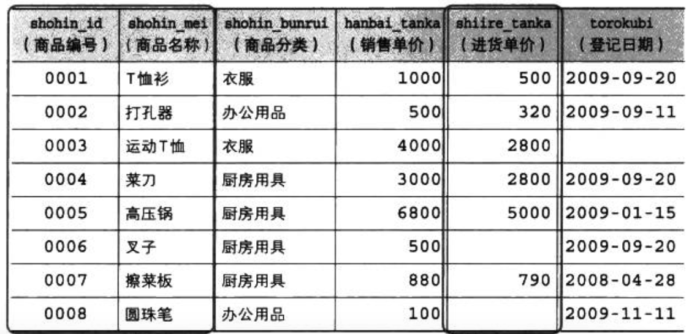

##指定列名
> 如果列的别名是中文时，使用双引号。

```
select shohin_id as id, shohin_name as name, shohin_tanka as "进货单价" from shohin;
```

```
select shohin_id as "商品编号", shohin_name as "商品名称", shohin_tanka as "进货单价" from shohin;
```
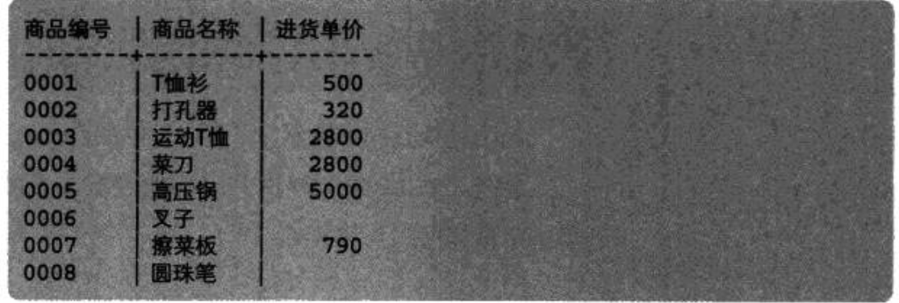


##为结果集添加一列常数

##删除结果集中的重复行
>如果结果集为一列，删除当前列中重复的数据。
>如果结果集中出现多个NULL，删除当前列中重复的NULL。
>如果结果集中有多列时，distinct修饰多列，只有当两行记录的每一列都相同时，才能认为是重复行。
>distinct必须写在所有查询列之前。
```
select distinct shohin_name from shohin;
```
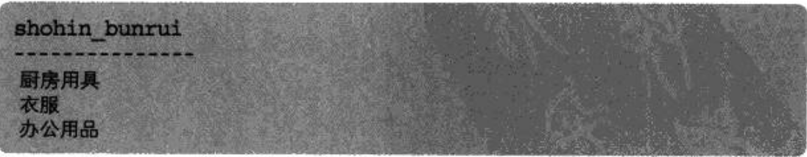

```
select distinct shiire_tanka from shohin;
```
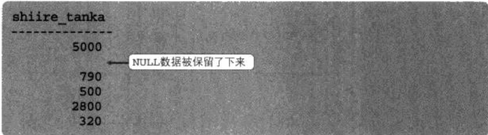

```
select distinct shohin_bunrui, torokubi from shohin;
```
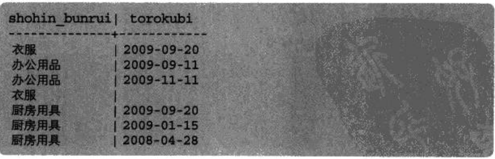

```
// 这样写时错误的，distinct必须写在所有结果列之前。
select shohin_bunrui, distinct torokubi from shohin;
```

##算数运算符
```
// where子句，结果集列中的列名，都可以使用算数运算符。
select shohin_mei, hanbai_tanka, hanbai_tanka *2 as hanbai_tanka_x2 from shohin;
```
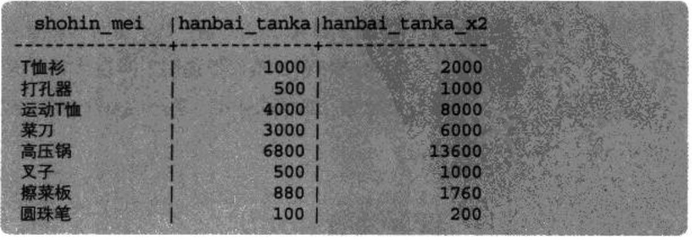

##比较运算符
>字符串比较大小时，根据ASCII码的大小排序。
>不能对NULL使用比较运算符。
>使用"<>"、“=”是无法获取到表中NULL的数据，SQL语句提供了is null 和 is not null 关键字来判断数据是否为空。

```
select shohin_mei, shohin_bunrui, torokubi from shohin where torokubi < '2009-09-27'
```
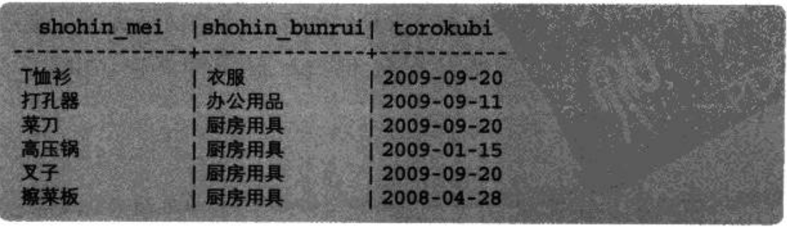

```
// 使用比较运算符 + 算数运算符查询销售单价(hanbai_tanka)比进货价(shiire_tanka)高出500以上的商品。
select shohin_mei, hanbai_tanka, shiire_tanka from shohin where hanbai_tanka - shiire_tanka >= 500;
```
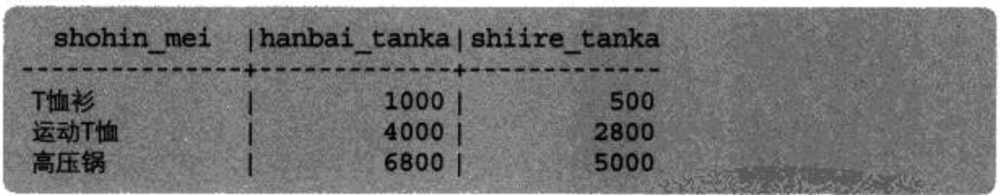

```
select shohin_mei, shiire_tanka from shohin where shiire_tanka = 2800;
```
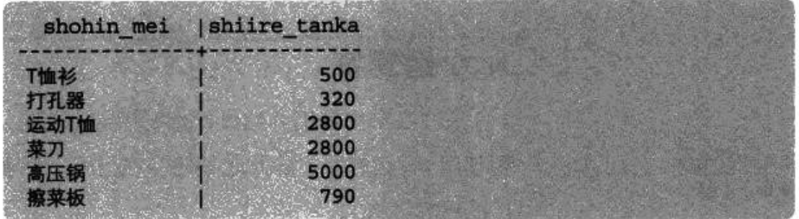

```
select shohin_mei, shiire_tanka from shohin where shiire_tanka <> 2800;
```
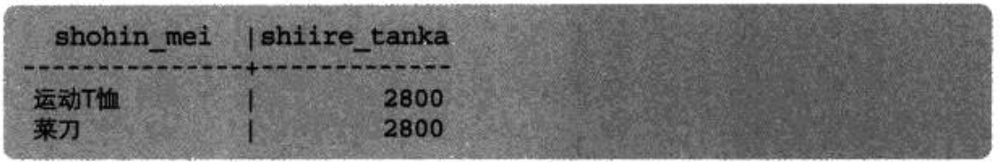

```
// = NULL 这种方式也不会获取到表中为空的数据。
select shohin_mei, shiire_tanka from shohin where shiire_tanka = NULL;
```
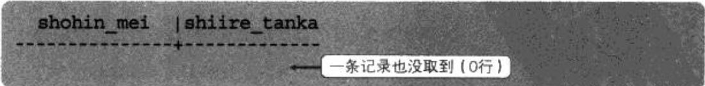

```
select shohin_mei, shiire_tanka from shohin where is NULL;
```
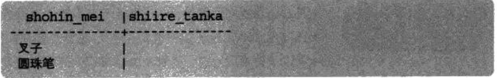

```
select shohin_mei, shiire_tanka from shohin where is NOT NULL;
```


##逻辑运算符
```
// 使用括号来，区分where子句判断的优先级
select shohin_mei, shohin_bunrui, torokubi from shohin where shohin_bunrui = '办公用品' and (torokubi = '2009-09-11' or torokubi = '2009-09-20');
```
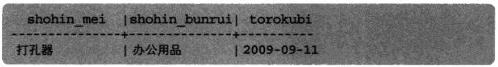

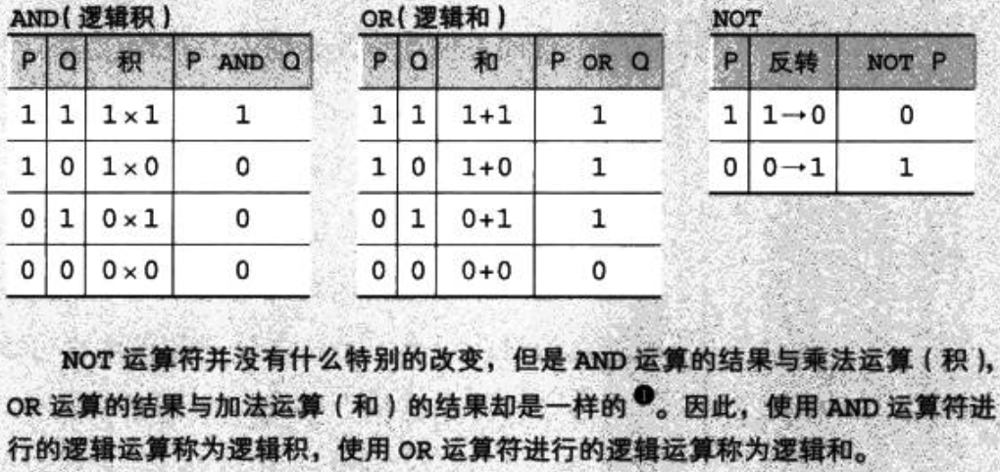

```
// 当where子句中有NULL判断时，因为引入了NULL，真值表的个数从4变成9。多了5中状态。
// 因此建议建立表的时候，给表的列中设置约束，not null。
select shohin_mei, shohin_bunrui, torokubi from shohin where shohin_bunrui = '办公用品' and torokubi is null;

select shohin_mei, shohin_bunrui, torokubi from shohin where shohin_bunrui = '办公用品' or torokubi is null;
```
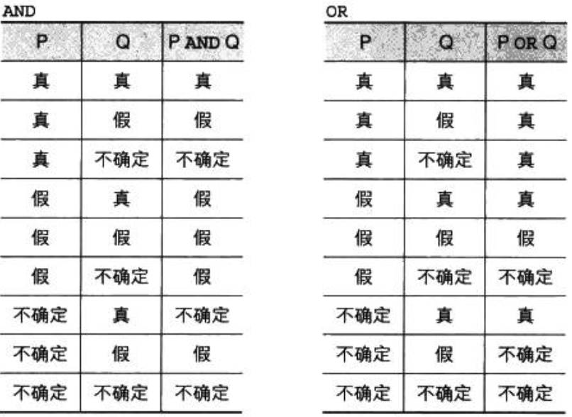


