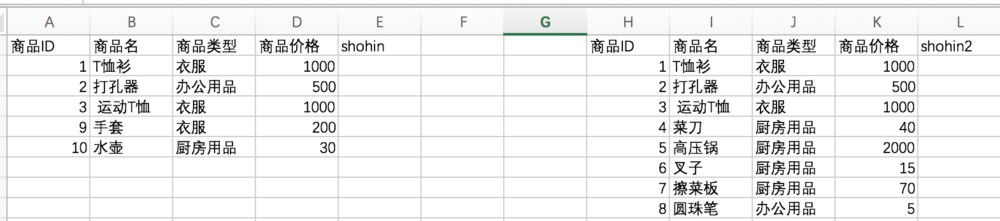
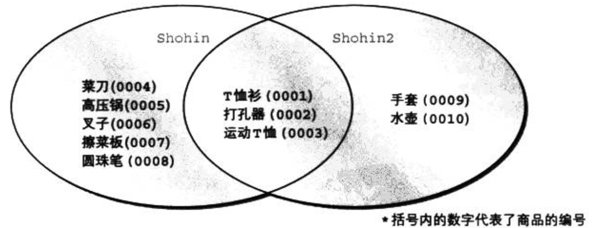
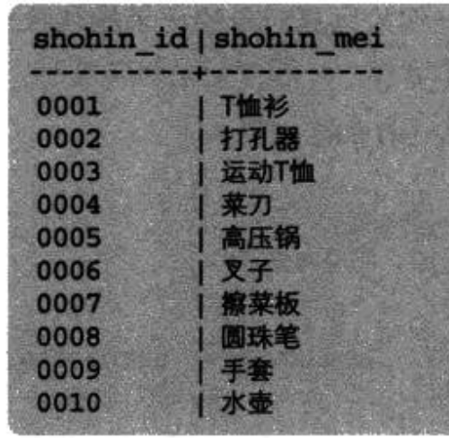
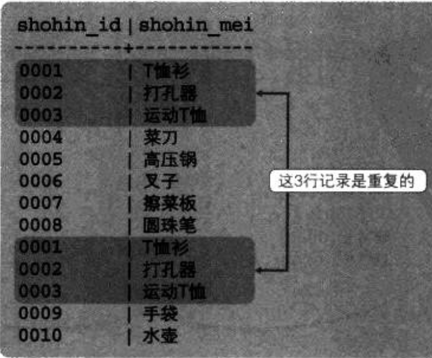
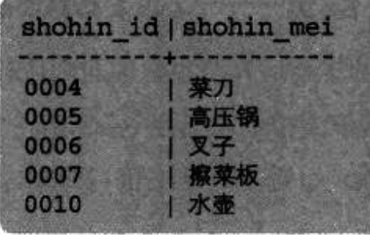
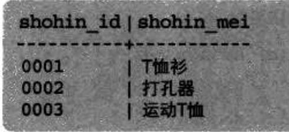
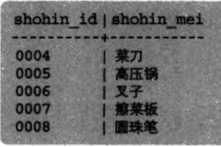
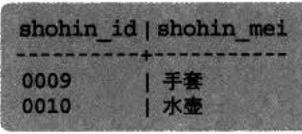

#2-2数据库查询-集合查询








>SQL语句的集合操作注意：
>1.两个表做集合操作时，两个表的结果集中列数必须一样。
>
>2.两个表做集合操作时，两个表的结果集中对应列的数据类型必须一致。
>
>3.order by语句只能写在语句最后，并且只能使用一次。其他子句不限制(where、group by等)

##SQL语句的并集运算
>

```
// 自动删除重复选项
select shohin_id, shohin_name from shohin 
union
select shohin_id, shohin_name from shohin2 order by shohin_id dsec;
```



```
// 显示重复的行
select shohin_id, shohin_name from shohin 
union all
select shohin_id, shohin_name from shohin2 
```




```
select shohin_id, shohin_name from shohin where shohin_type = '厨房用品'
union 
select shohin_id, shohin_name from shohin2 where shohin_type = '厨房用品' order by shohin_id;
```



##SQL语句的差集运算
> 显示第一个结果集中私有数据。即删除第一个结果集的交集部分。

```
select shohin.id, shohin.name from shohin
except
select shohin_id, shohin_name from shohin2
```



```
select shohin_id, shohin_name from shohin2
except
select shohin_id, shohin_name from shohin
```



##SQL语句的交集运算
```
// 自动删除重复行
select shohin.id, shohin.name from shohin 
intersect
select shohin.id, shohin.name from shohin2
```



```
// 显示重复的行
select shohin.id, shohin.name from shohin 
intersect all
select shohin.id, shohin.name from shohin2
```


